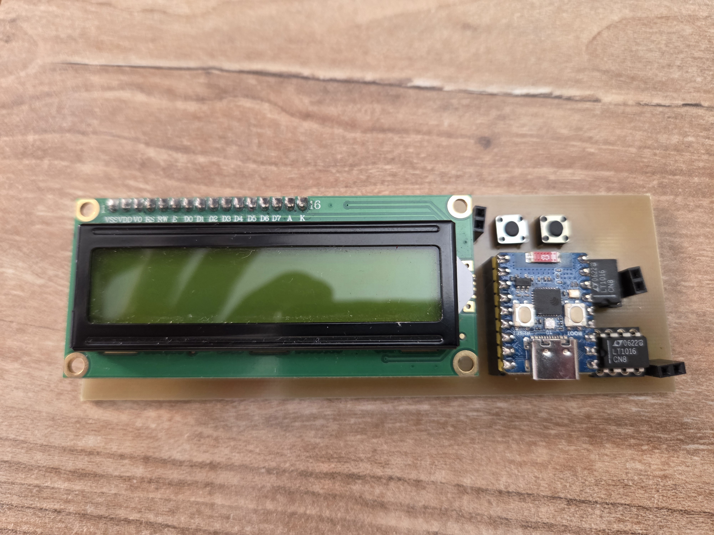
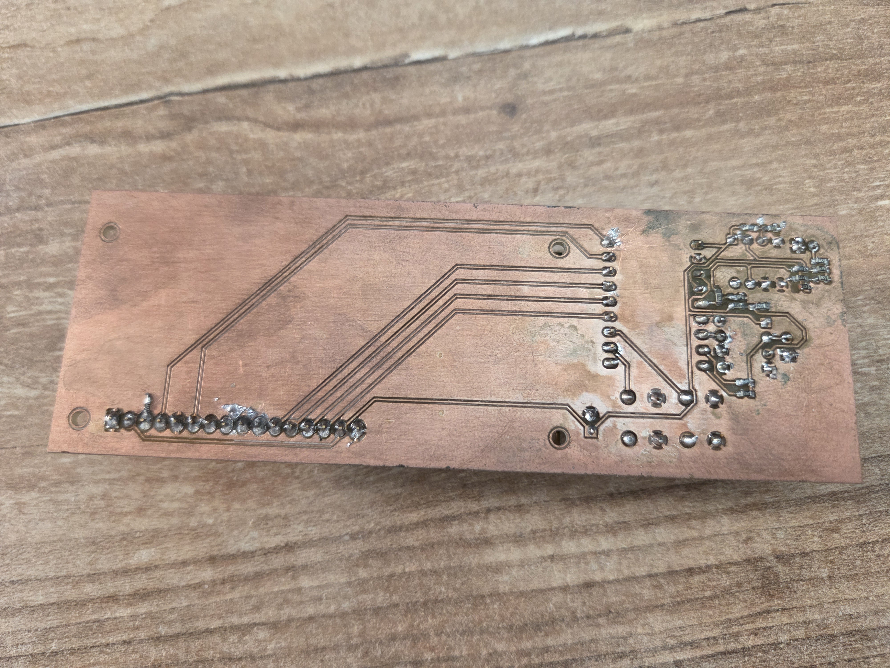
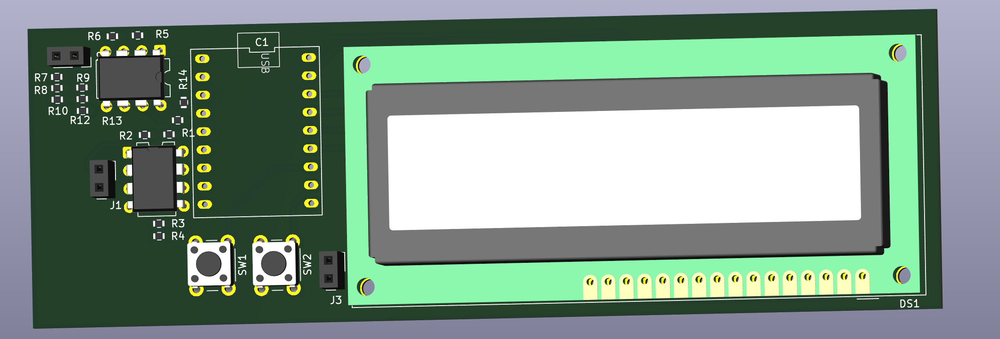

<div align="center">

# 🔬 ESP32-C3-Zero Capacitance & Frequency Meter

### Compact open-source capacitance and frequency meter

### Kompaktowy miernik pojemności i częstotliwości

<br>

🇵🇱 **Polski** | 🇬🇧 **English**

<br>

</div>

---

# 🇵🇱 Polski

## 📖 Opis projektu

**ESP32-C3-Zero Capacitance & Frequency Meter** to kompaktowy, otwartoźródłowy miernik pojemności oraz częstotliwości oparty na mikrokontrolerze **ESP32-C3-Zero**.

Projekt został stworzony jako niedrogie i praktyczne narzędzie pomiarowe do pracy z elektroniką. Urządzenie pozwala mierzyć pojemność kondensatorów oraz częstotliwość sygnałów cyfrowych.

Repozytorium zawiera zarówno część programową, jak i sprzętową projektu: firmware, schemat oraz projekt PCB wykonany w **KiCad 9.0**.

---

## 📸 Zdjęcia projektu

<div align="center">

### Gotowe urządzenie



<br><br>

### Spód płytki PCB



<br><br>

### Wizualizacja 3D PCB



</div>


---

## ✨ Najważniejsze funkcje

* ⚡ Pomiar pojemności kondensatorów
* 📡 Pomiar częstotliwości sygnałów
* 🔁 Automatyczny dobór zakresu pomiarowego
* 🎯 Funkcja TARE do kompensacji pojemności pasożytniczej
* ⏸️ Funkcja zatrzymania pomiaru częstotliwości
* 🧩 Projekt PCB wykonany w KiCad 9.0
* 🔓 Otwarty kod źródłowy
* 🛠️ Możliwość dalszej rozbudowy projektu

---

## ⚙️ Zasada działania

### ⚡ Pomiar pojemności

Pomiar pojemności realizowany jest poprzez pomiar czasu ładowania kondensatora przez rezystor o znanej wartości.

Mikrokontroler **ESP32-C3-Zero** mierzy czas potrzebny do osiągnięcia określonego progu napięcia wykrywanego przez szybki komparator **LT1016**.

W projekcie zastosowano dwa zakresy pomiarowe:

| Zakres          | Rezystor |
| --------------- | -------- |
| Małe pojemności | 100 kΩ   |
| Duże pojemności | 2.2 kΩ   |

Przełączanie zakresu odbywa się automatycznie w programie.

---

### 📡 Pomiar częstotliwości

Sygnał wejściowy podawany jest bezpośrednio na wejście mikrokontrolera ESP32-C3.

Każde narastające zbocze sygnału wywołuje przerwanie sprzętowe. Program zlicza impulsy w określonym czasie, a następnie przelicza wynik na częstotliwość.

Obsługiwane jednostki:

* Hz
* kHz
* MHz

---

## 🔧 Wykorzystane elementy

| Element         | Opis                       |
| --------------- | -------------------------- |
| ESP32-C3-Zero   | Główny mikrokontroler      |
| LT1016          | Szybki komparator napięcia |
| Rezystor 100 kΩ | Zakres małych pojemności   |
| Rezystor 2.2 kΩ | Zakres dużych pojemności   |
| Przyciski TACT  | Sterowanie urządzeniem     |
| Złącza goldpin  | Wejścia pomiarowe          |

---

## 📦 Zawartość repozytorium

Repozytorium zawiera:

* 📄 Firmware dla ESP32-C3-Zero
* 🧩 Schemat elektryczny KiCad 9.0
* 🧩 Projekt PCB KiCad 9.0
* 📷 Zdjęcia gotowego urządzenia
* 📘 Dokumentację projektu

---

## 📂 Struktura projektu

```text
.
├── firmware/
│   └── cap&frq_meter.ino
│
├── hardware/
│   ├── cap&frq_meter.kicad_sch
│   └── cap&frq_meter.kicad_pcb
│
├── images/
│
├── README.md
└── LICENSE
```

---

## 🛠️ Oprogramowanie

Firmware został napisany w języku **C++** z wykorzystaniem środowiska **Arduino IDE** oraz rdzenia **Arduino Core for ESP32**.

Wykorzystane biblioteki:

* Arduino Core for ESP32
* LiquidCrystal

---

## 🚀 Możliwe rozszerzenia

* Pomiar ESR kondensatorów
* Pomiar rezystancji
* Pomiar indukcyjności
* Wyświetlacz OLED/TFT
* Zasilanie akumulatorowe
* Automatyczna kalibracja
* Rozszerzenie zakresów pomiarowych

---

<br>

<div align="center">

# 🇬🇧 English

</div>

---

## 📖 Project Description

**ESP32-C3-Zero Capacitance & Frequency Meter** is a compact open-source capacitance and frequency meter based on the **ESP32-C3-Zero** microcontroller.

The project was created as a low-cost and practical measurement tool for electronics work. The device can measure capacitor values and digital signal frequencies.

This repository contains both the software and hardware parts of the project: firmware, schematic and PCB design created in **KiCad 9.0**.

---

## 📸 Project Gallery

<div align="center">

### Finished Device


<br><br>

### PCB Bottom Layer


<br><br>

### 3D PCB View


</div>

---

## ✨ Key Features

* ⚡ Capacitance measurement
* 📡 Frequency measurement
* 🔁 Automatic measurement range selection
* 🎯 TARE compensation for parasitic capacitance
* ⏸️ Frequency measurement hold function
* 🧩 PCB design created in KiCad 9.0
* 🔓 Open-source firmware
* 🛠️ Easy to modify and expand

---

## ⚙️ Operating Principle

### ⚡ Capacitance Measurement

Capacitance is measured by monitoring the charging time of a capacitor through a resistor with a known value.

The **ESP32-C3-Zero** measures the time required to reach a voltage threshold detected by the high-speed **LT1016** comparator.

Two measurement ranges are used:

| Range              | Resistor |
| ------------------ | -------- |
| Small capacitances | 100 kΩ   |
| Large capacitances | 2.2 kΩ   |

Range switching is performed automatically in firmware.

---

### 📡 Frequency Measurement

The input signal is connected directly to an ESP32-C3 input pin.

Each rising edge of the signal generates a hardware interrupt. The firmware counts pulses over a defined time period and converts the result into frequency.

Supported units:

* Hz
* kHz
* MHz

---

## 🔧 Hardware Components

| Component       | Description                   |
| --------------- | ----------------------------- |
| ESP32-C3-Zero   | Main microcontroller          |
| LT1016          | High-speed voltage comparator |
| 100 kΩ resistor | Small capacitance range       |
| 2.2 kΩ resistor | Large capacitance range       |
| TACT switches   | User controls                 |
| Pin headers     | Measurement inputs            |

---

## 📦 Repository Contents

This repository contains:

* 📄 Firmware for ESP32-C3-Zero
* 🧩 KiCad 9.0 schematic file
* 🧩 KiCad 9.0 PCB file
* 📷 Photos of the assembled device
* 📘 Project documentation

---

## 📂 Project Structure

```text
.
├── firmware/
│   └── cap&frq_meter.ino
│
├── hardware/
│   ├── cap&frq_meter.kicad_sch
│   └── cap&frq_meter.kicad_pcb
│
├── images/
│
├── README.md
└── LICENSE
```

---

## 🛠️ Software

The firmware is written in **C++** using **Arduino IDE** and **Arduino Core for ESP32**.

Libraries used:

* Arduino Core for ESP32
* LiquidCrystal

---

## 🚀 Future Improvements

* ESR measurement
* Resistance measurement
* Inductance measurement
* OLED/TFT display support
* Battery-powered version
* Automatic calibration
* Extended measurement ranges

---

## 📄 License

Released under the MIT License.

Feel free to use, modify and improve the project.

---

<div align="center">

### ⭐ If you like this project, consider leaving a star on GitHub.

</div>
